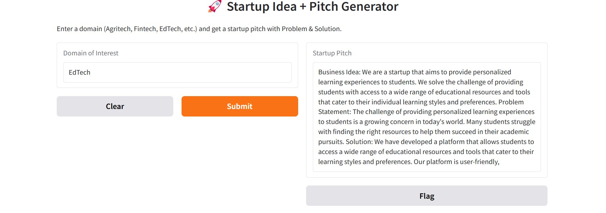

# 🚀 Startup Pitch Generator

Generate compelling startup ideas and investor-ready pitches with the help of AI! Just enter a domain (like **Fintech**, **Agritech**, or **EdTech**), and the app returns a structured pitch including:

- Business Idea  
- Problem Statement  
- Solution  

Built using [Hugging Face Transformers](https://huggingface.co/transformers/), [Gradio](https://www.gradio.app/), and an instruction-tuned T5 model from MBZUAI.

---

## ✨ Features

✅ AI-generated startup pitches tailored to your input domain  
✅ Includes Business Idea, Problem, and Solution structure  
✅ Clean and simple Gradio web interface  
✅ Powered by the LaMini-Flan-T5-783M model  

---

## 📸 Demo

Try it live (hosted via Gradio):

[]((https://aac277452d315fd550.gradio.live/))

---

## 🧠 Model Used

**Model Name**: `MBZUAI/LaMini-Flan-T5-783M`  
**Type**: Instruction-tuned text2text generation model  
**Source**: [Hugging Face](https://huggingface.co/MBZUAI/LaMini-Flan-T5-783M)

---

## 💡 Example Output

**Input Domain**: `EdTech`

**Output**:
```

Business Idea: We are a startup that aims to revolutionize the education industry by providing personalized learning experiences for students.

Problem Statement: Traditional education often lacks personalization, making it hard for students to learn at their own pace and style.

Solution: We’ve built an AI-powered platform that creates tailored learning journeys, complete with interactive tools like quizzes, whiteboards, and learning plans.

```

---

## 🖼️ Screenshot

Here’s how the app looks in action:



---

## 📁 Project Structure

```

├── Idea_Generator.ipynb          # Jupyter notebook with full code
├── README.md                     # Project documentation
└── startup-idea-generator.jpg    # Screenshot of the Gradio app

```
